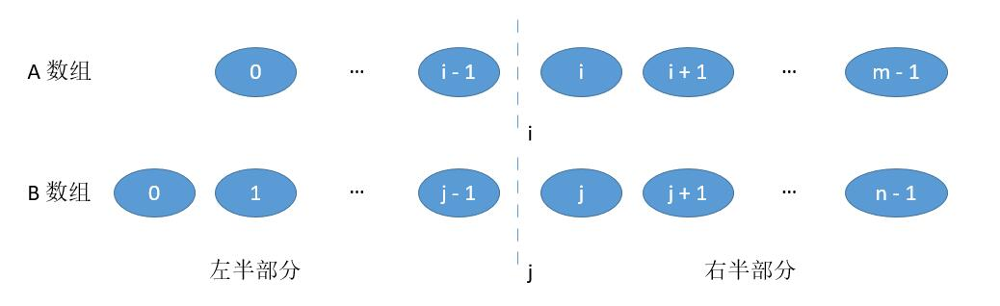

## 算法1

**(二分) O(log(min(m，n))**

只需将数组进行切分，一个长度为m的数组，从0到m共有m+1个位置可以切分。<br>
<br>
把数组A和数组B分别在i和j进行切割。<br>
<br>
将i的左边和j的左边组合成 *[左半部分]* ，将i的右边和j的右边合成 *[右半部分]*

- 当A数组和B数组的总长度是偶数时，如果我们能够保证<br>
  *左半部分的长度等于右半部分
  
    `i + j = m - i + n - j` <br>
  *左半部分最大值小于右半部分最小值 _max(A[i - 1], B[j - 1]) <= min(A[i], B[i])_,那么，中位数表示为<br>
  `(max(A[i - 1], B[j - 1]) + min(A[i], B[j])) / 2`

- 当A数组和B数组的总长度是奇数时，如果能够保证<br>
  *左半部分比右半部分大1<br>
  `i + j = m - i + n - j + 1` <br>
  *左半部分最大值小于等于右半部分最小值_max(A[i - 1], B[j - 1]) <= min(A[i], B[i])_, 那么中位数就是<br>
  `max(A[i - 1], B[j - 1])`<br>

上边的第一个条件可以合并为`j = (m + n + 1) / 2 - i`, 因为m + n是偶数，由于int取整，所以加1无影响。由于`0 <= i <= m`,为了保证`0 <= j <= n`,我们必须保证`m <= n`。<br>

为了保证`max(A[i-1], B[j - 1] <= min(A[i], B[j])`,由于A、B数组有序，所以`A[i - 1] <= B[j]`,所以分两种情况讨论:<br>
  
  - B[j - 1] > A[i],为了不越界，要保证`j != 0, i != m`<br>
  

    此时需要增加i,为了数量平衡还需要减少j, `j = (m + n + 1) / 2 - i`, i增大，j自然减小。
  - `A[i - 1] > B[j]`, 为了不越界，要保证`i != 0, j != n`<br>
  
  此时需要减小i， 增大j。<br>
  对于边界情况需要单独讨论。
  - 切在最前边，当`i = 0`，最大值就是`B[j-1]`;当`j = 0`时，最大值就是`A[i-1]`<br>
  
  - 切在最后边，当`i = m`时最小值为`B[j]`，当`j = n`时,最小值为`A[i]`<br>
  
   **i的变更方式使用二分法，初始化为中间值，然后折半找中间的**<br>

**CPP代码**
``` CPP
class Solution {
public:
    double findMedianSortedArrays(vector<int>& nums1, vector<int>& nums2) {
        if(nums1.size()>nums2.size())
            return findMedianSortedArrays(nums2, nums1);
        
        int len=nums1.size()+nums2.size();
        int cutL=0, cutR=nums1.size()-1;
        int cut1, cut2;
        
        while(true){
            cut1 = cutL+(cutR-cutL)/2;
            cut2 = len/2-cut1;
            int L1 = (cut1==0) ? INT_MIN : nums1[cut1-1];
            int L2 = (cut2==0) ? INT_MIN : nums2[cut2-1];
            int R1 = (cut1==nums1.size()) ? INT_MAX : nums1[cut1];
            int R2 = (cut2==nums2.size()) ? INT_MAX : nums2[cut2];
            if(L1>R2) // to left
                cutR = cut1-1;
            else if(L2>R1) //to right
                cutL = cut1+1;
            else{
                if(len%2==0) // even , choose (k-1, k)/2
                    return (max(L1, L2) + min(R1, R2))/2.0;
                else  //odd
                    return min(R1, R2);
            }
        }
    }
};
```

**Python代码**
``` Python
class Solution:
    def findMedianSortedArrays(self, nums1: List[int], nums2: List[int]) -> float:
        if len(nums1) > len(nums2):
            return self.findMedianSortedArrays(nums2, nums1)
        m, n = len(nums1), len(nums2)
        imin, imax = 0, m 
        
        while imin <= imax:
            i = (imin+imax)//2     #nums1的切分点
            j = (m+n+1) // 2 - i   #nums2的切分点
            
            if i<m and nums2[j-1] > nums1[i]: #i 太小
                imin = i + 1
            elif i>0 and nums1[i-1] > nums2[j]: #i 太大
                imax = i - 1
            else:
                if i==0: max_of_left = nums2[j-1]
                elif j==0: max_of_left = nums1[i-1]
                else:    max_of_left = max(nums1[i-1], nums2[j-1])
                
                if (m + n) % 2 == 1:   #奇数
                    return max_of_left
                
                if i == m:   min_of_right = nums2[j]
                elif j == n: min_of_right = nums1[i]
                else:
                    min_of_right = min(nums1[i], nums2[j])
                
                return (max_of_left + min_of_right) / 2.0
```