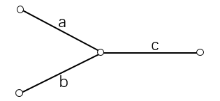

## 算法1

**(链表，指针扫描) *O(n)***

1. 用两个指针分别从两个链表头部开始扫描，每次分别走一步；
2. 如果指针走到null，则从另一个链表头部开始走；
3. 当两个指针相同时，
    * 如果指针不是null，则指针位置就是相遇点；
    * 如果指针是 null，则两个链表不相交；

图示：
1. 两个链表不相交；<br>
   
   a,b 分别代表两个链表的长度，则两个指针分别走 a+b 步后都变成 null。
2. 两个链表相交；<br>
   
   则两个指针分别走 a+b+ca+b+c 步后在两链表交汇处相遇。
```CPP
class Solution {
public:
    ListNode *getIntersectionNode(ListNode *headA, ListNode *headB) {
        ListNode *p = headA, *q = headB;
        while (p != q)
        {
            if (p)  p = p -> next;
            else    p = headB;
            if (q)  q = q -> next;
            else    q = headA;
        }
        return p;
    }
};
```